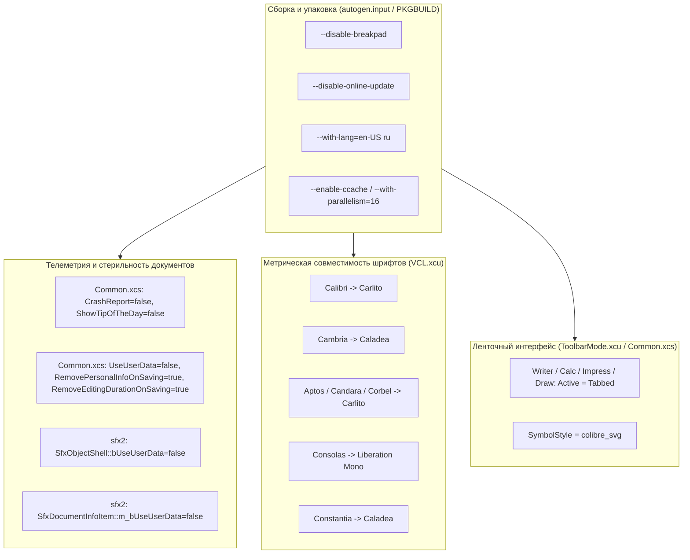

# Архитектура форка LibreOffice (MSCompat Fork)

## Общая структура изменений

```mermaid
flowchart TD
    subgraph Build["Сборка и упаковка (autogen.input / PKGBUILD)"]
        A1["--disable-breakpad"]
        A2["--disable-online-update"]
        A3["--with-lang=en-US ru"]
        A4["--enable-ccache / --with-parallelism=16"]
    end

    subgraph Privacy["Телеметрия и стерильность документов"]
        P1["Common.xcs: CrashReport=false, ShowTipOfTheDay=false"]
        P2["Common.xcs: UseUserData=false, RemovePersonalInfoOnSaving=true, RemoveEditingDurationOnSaving=true"]
        P3["sfx2: SfxObjectShell::bUseUserData=false"]
        P4["sfx2: SfxDocumentInfoItem::m_bUseUserData=false"]
    end

    subgraph Fonts["Метрическая совместимость шрифтов (VCL.xcu)"]
        F1["Calibri -> Carlito"]
        F2["Cambria -> Caladea"]
        F3["Aptos / Candara / Corbel -> Carlito"]
        F4["Consolas -> Liberation Mono"]
        F5["Constantia -> Caladea"]
    end

    subgraph UI["Ленточный интерфейс (ToolbarMode.xcu / Common.xcs)"]
        U1["Writer / Calc / Impress / Draw: Active = Tabbed"]
        U2["SymbolStyle = colibre_svg"]
    end

    Build --> Privacy
    Build --> Fonts
    Build --> UI
```
